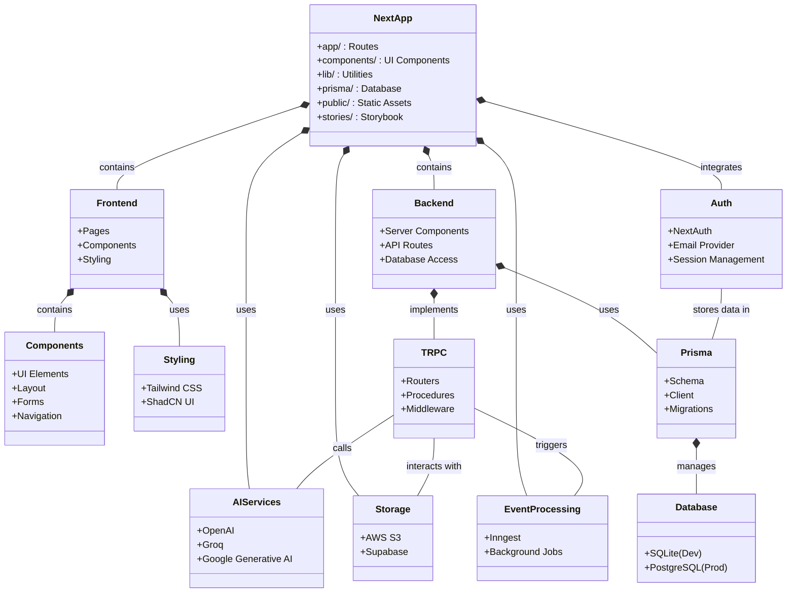

# Next.js AI Starter Codebase Architecture

This document provides a visual reference of the codebase architecture to help new developers understand the structure and relationships between different components.

## Architecture Diagram



## Architecture Overview

### Frontend

- **Pages**: App Router directory structure with route components
- **UI Components**: Reusable React components styled with Tailwind CSS and ShadCN UI
- **Storybook**: Component documentation and testing environment

### Backend

- **Next.js Server**: Handles server-side rendering and API routes
- **Server Components**: React Server Components that fetch data
- **API Routes**: API endpoints in `/app/api/*` directory
- **tRPC**: Type-safe API layer connecting frontend and backend
- **Prisma ORM**: Database access layer with schema definitions
- **Database**: SQLite for local development, PostgreSQL for production

### Authentication

- **NextAuth.js**: Authentication provider integration
- **Prisma Adapter**: Stores user sessions and accounts in the database
- **Email Provider**: Email-based authentication

### AI Services

- **OpenAI**: Integration for ChatGPT and other OpenAI models
- **Groq**: Fast AI inference alternative
- **Google Generative AI**: Integration for Google's AI models

### Storage

- **AWS S3**: Cloud storage for files and assets
- **Supabase**: Additional storage and backend features

### Event Processing

- **Inngest**: Handles asynchronous workflows and background jobs

## Key Development Flows

1. **Authentication Flow**: Users authenticate through NextAuth → User data stored in database through Prisma adapter
2. **API Request Flow**: Client makes request → tRPC validates types → Prisma queries database → Response returned to client
3. **AI Integration Flow**: User sends prompt → API route calls AI service → Response processed and returned

## File Structure (Simplified)

```
/
├── app/                  # Next.js App Router
│   ├── api/              # API Routes
│   ├── auth/             # Authentication pages
│   └── ...               # Other routes
├── components/           # Reusable UI components
├── lib/                  # Utility functions and libraries
├── prisma/               # Prisma schema and migrations
│   └── schema.prisma     # Database schema
├── public/               # Static assets
├── stories/              # Storybook component documentation
├── styles/               # Global styles
├── .env                  # Environment variables
├── next.config.js        # Next.js configuration
├── postcss.config.js     # PostCSS configuration
├── tailwind.config.js    # Tailwind CSS configuration
└── package.json          # Dependencies and scripts
```
